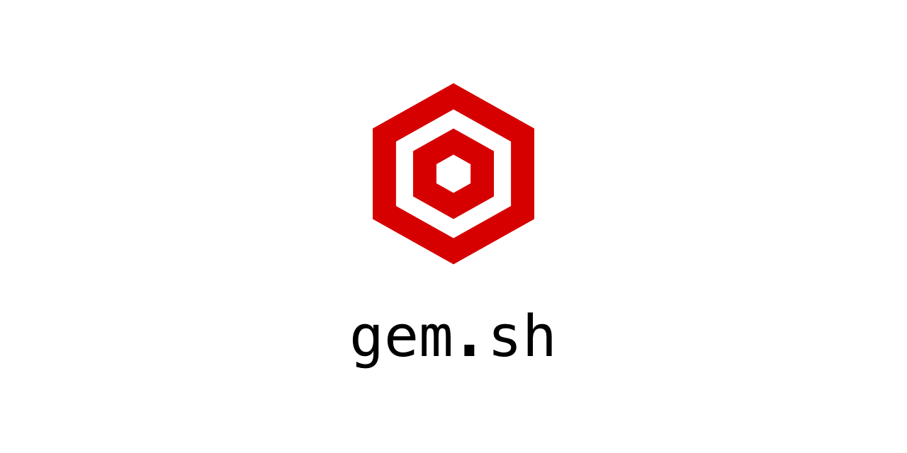

  <h1 align="center">Welcome to gem.sh</h1>

 

### gem.sh - Beautiful Documentation for any Ruby gem

Welcome to gem.sh and to the future of documentation for all Ruby gems!

gem.sh is a documentation hub designed to improve the way you interact with your favorite gems. gem.sh statically analyzes and parses your favorite gems to provide annotated code, navigation, and documentation in a nice package.

### Deployed Version

The current version is available at [gem.sh](https://gem.sh), providing on-the-fly dynamic rendering of your documentation. While it's a work in progress and might be a bit slow due to real-time analysis, it perfectly demonstrates the future potential.

### Future Vision

The ultimate vision for gem.sh is to transform it into a site generator that generates static HTML files. This will enable users to deploy their documentation anywhere efficiently. This feature will also be beneficial for private applications and gems.

It's designed with both gem maintainers and users in mind. gem.sh tried to go beyond autogenerated reference/API documentation. [gem.sh](https://gem.sh) aims to be the go-to community hub for Ruby gems, hosting references, docs, guides, and links to community-generated content such as videos, articles, and comments about a gem.

For gem maintainers with their own domain, gem.sh might be able to offer a solution, so that they can simply point their domain to [gem.sh](https://gem.sh) and receive a hosted documentation site with all the goodies.

### Open Source and Collaboration

We've open-sourced the code for gem.sh. We welcome contributors from the Ruby community to join us on this journey of building a documentation future that benefits everyone!

Please feel free to reach out if you have any ideas or would like to contribute to this project. Together, let's shape the future of Ruby gem documentation!
